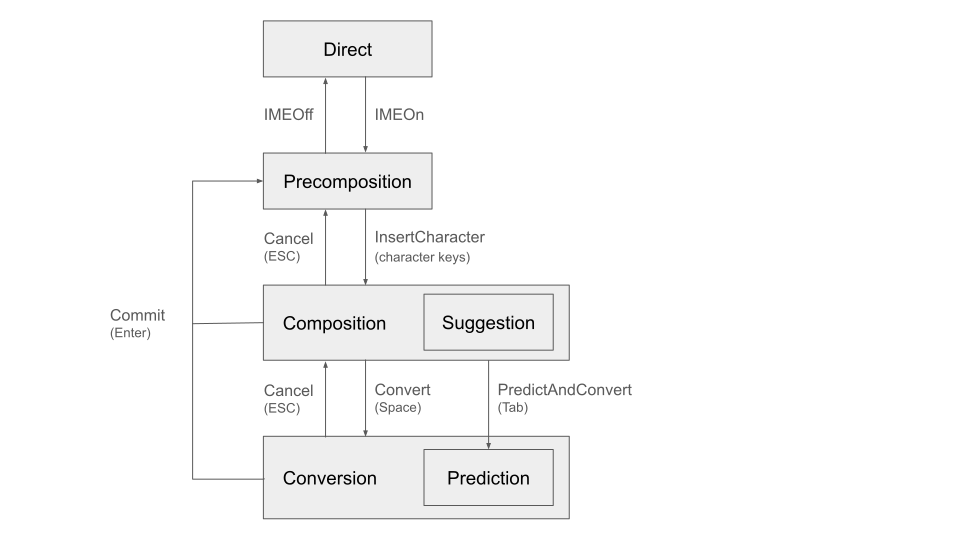
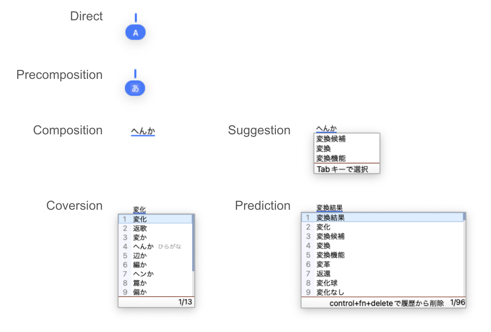
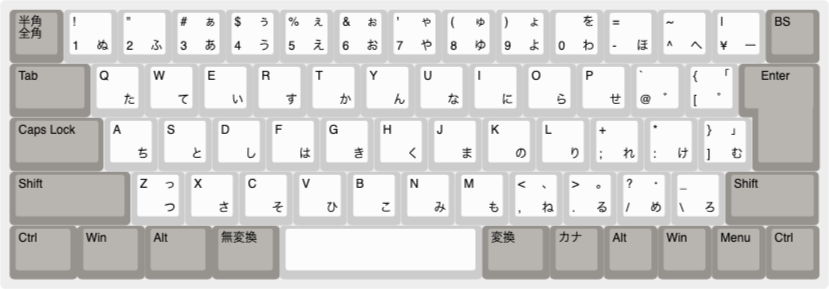
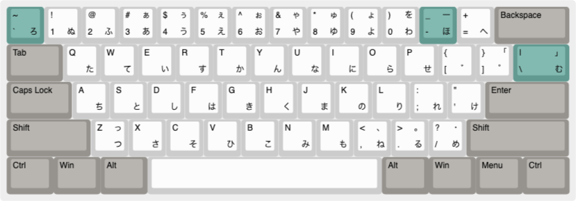

# Configurations

## Date format converted from "きょう"

This is an EXPERIMENTAL feature. This feature may be changed or removed in
future.

The conversion from "きょう" returns the current date in some formats like
"2021年10月1日" and "2021-10-01".

You can add an extra format by adding an entry of "DATA_FORMAT" to the user
dictionary.

| Reading     | Word                  | Category |
| ----------- | --------------------- | -------- |
| DATE_FORMAT | {YEAR}.{MONTH}.{DATE} | 名詞     |

Any category is OK so far.

| key     | value                |
| ------- | -------------------- |
| {YEAR}  | 4 digits year (2021) |
| {MONTH} | 2 digits month (10)  |
| {DATE}  | 2 digits date (01)   |
| {{}     | single { character   |

## Keymap (shortcut keys)

Shortcut keys are configurable from the preferences dialog GUI.

*   Preferences GUI > General tab > Keymap > Keymap style.

There are three predefined keymaps

*   ATOK
*   MS-IME (default for Windows)
*   Kotoeri (default for macOS)

Full customization is also available.

### Input modes

*   Direct: Mode to type Latin characters without IME.
*   Precomposition: Mode to type Hiragana characters, but no character is typed
    yet.
*   Composition: Mode to type Hiragana characters.
*   Suggestion: Sub-mode of Composition. Some word suggestions have appeared,
    but no candidate is focused.
*   Conversion: Mode to select words (in Kanji). Candidate words are generated
    by exact-match (by Space key).
*   Prediction: Sub-mode of Conversion. Candidate words are generated by
    prefix-match (by Tab key).




## Configuration path

Mozc creates configuration files under `$XDG_CONFIG_HOME/mozc` (default:
`~/.config/mozc`). If `~/.mozc` already exists, `~/.mozc` is used for backward
compatibility.

## Configuration files

`config1.db` stores configurations managed by the GUI configuration tool. The
format is binary protocol buffer of
[mozc.config.Config](https://github.com/google/mozc/blob/master/src/protocol/config.proto).

The following command can decode `config1.db` to text protocol buffer format.

```
# Decode to text proto
protoc --decode=mozc.config.Config protocol/config.proto < config1.db > config.textproto
```

```
# Encode to binary proto
protoc --encode=mozc.config.Config protocol/config.proto < config.textproto > config1.db
```

`protoc` can be built as follows

```
bazelisk build @com_google_protobuf//:protoc
```

## IBus

Starting from version 2.26.4220, IBus specific configurations are customizable
in `~/.config/mozc/ibus_config.textproto`.

The file path may be `~/.mozc/ibus_config.textproto` if `~/.mozc` directory
already exists.

Here is the default configuration as of version 2.29.5205.

```
# `ibus write-cache; ibus restart` might be necessary to apply changes.
engines {
  name : "mozc-jp"
  longname : "Mozc"
  layout : "default"
  layout_variant : ""
  layout_option : ""
  rank : 80
  symbol : "あ"
}
engines {
  name : "mozc-on"
  longname : "Mozc:あ"
  layout : "default"
  layout_variant : ""
  layout_option : ""
  rank : 99
  symbol : "あ"
  composition_mode : HIRAGANA
}
engines {
  name : "mozc-off"
  longname : "Mozc:A_"
  layout : "default"
  layout_variant : ""
  layout_option : ""
  rank : 99
  symbol : "A"
  composition_mode : DIRECT
}
active_on_launch: False
mozc_renderer {
  # Set 'False' to use IBus' candidate window.
  enabled : True
  # For Wayland sessions, 'mozc_renderer' will be used if and only if any value
  # set in this field (e.g. "GNOME", "KDE") is found in $XDG_CURRENT_DESKTOP.
  # https://specifications.freedesktop.org/desktop-entry-spec/desktop-entry-spec-latest.html#recognized-keys
  compatible_wayland_desktop_names : ["GNOME"]
}
```

The variables of `engines` are mapped to the same named variables of IBus.

⚠️ After modification of `ibus_config.textproto`, `ibus write-cache; ibus
restart` might be necessary to apply changes.

⚠️ Some settings are available only in newer versions of Mozc. To reset the
settings to default, simply delete `ibus_config.textproto` then run
`ibus write-cache; ibus restart`.

### Specify the keyboard layout

`layout` represents the keyboard layout (e.g. JIS keyboard, US keyboard, etc.).

Sample configuration:

```
engines {
  name : "mozc-jp"
  longname : "Mozc"
  layout : "jp"  # or "us"
  layout_variant : ""
  layout_option : ""
  rank : 80
}
active_on_launch: False
```

### Activate Mozc on launch

`active_on_launch` represents the default input. If it's True, Hiragana input is
the default mode. `active_on_launch` is supported by 2.26.4317 or later.

Sample configuration:

```
engines {
  name : "mozc-jp"
  longname : "Mozc"
  layout :"default"
  layout_variant : ""
  layout_option : ""
  rank : 80
}
active_on_launch: True  # default is False.
```

### Multiple engines with different keyboard layouts

`engines` can be multiple entries.

```
engines {
  name : "mozc-jp"
  longname : "Mozc"
  layout : "jp"
  layout_variant : ""
  layout_option : ""
  rank : 80
}
engines {
  name : "mozc-us"
  longname : "Mozc US"
  layout : "us"
  layout_variant : ""
  layout_option : ""
  rank : 80
}
active_on_launch: False
```

### Fixed composition mode per engine

`composition_mode` specifies the composition mode every time the engine is
enabled. This is useful to switch the composition mode by using IBus hot keys.

The available values are `DIRECT`, `HIRAGANA`, `FULL_KATAKANA`, `HALF_ASCII`, `FULL_ASCII`, `HALF_KATAKANA`, and `NONE`.
`NONE` does not change the composition mode.

`symbol` is a label to represent the engine used by IBus.

`composition_mode` and `symbol` are available in 2.28.4950 and later versions.

```
engines {
  name : "mozc-on"
  longname : "Mozc:あ"
  layout : "default"
  layout_variant : ""
  layout_option : ""
  rank : 80
  symbol : "あ"
  composition_mode: HIRAGANA
}
engines {
  name : "mozc-off"
  longname : "Mozc:A_"
  layout : "default"
  layout_variant : ""
  layout_option : ""
  rank : 80
  symbol: "A"
  composition_mode: DIRECT
}
```

### Candidate window

Linux input method frameworks (e.g. IBus and Fcitx) often provide their own
candidate window UI, while Mozc also provides candidate window UI via
`mozc_renderer` process that is used in macOS and Windows as well.

Here is the quick comparison of two options.

##### Mozc's candidate window

 * Provides the same UI and functionality as Mozc for macOS and Windows.
 * Always needs to use X11 protocol, even under Wayland sessions
   ([#794](https://github.com/google/mozc/issues/794)).
 * Theme support (e.g. dark theme) is planned but not yet implemented.

##### IBus' candidate window

 * Provides a UI that is consistent with the desktop environment (e.g. theme
   support including dark mode).
 * Supports GNOME Wayland by using deep integration with the desktop shell.
 * Lacks several features that are available in Mozc for macOS and Windows.

To use IBus' default candidate window, set `enabled : False` as follows.

```
# This settings are available in 2.29.5205 and later versions
mozc_renderer {
  # This means IBus' candidate window is always used.
  enabled : False
}
```

Then restart IBus as follows for your change to take effect.
```
ibus restart
```

#### Wayland compatibility of Mozc's candidate window

While how to support IMEs' candidate window UI under Wayland sessions is still
[under discussion](https://gitlab.freedesktop.org/wayland/wayland-protocols/-/issues/40),
in some desktop environments such as GNOME, Mozc's candidate window may continue
to work with XWayland ([#794](https://github.com/google/mozc/issues/794)).

You can configure which Wayland desktop environment is compatible with Mozc's
candidate window will be used as follows.

```
# This settings are available in 2.29.5205 and later versions
mozc_renderer {
  enabled : True
  compatible_wayland_desktop_names : ["GNOME"]
}
```

When one of the desktop name specified in `compatible_wayland_desktop_names` is
found in `$XDG_CURRENT_DESKTOP` environment variable, Mozc's candidate window
will be used.

Restart IBus as follows for your change to take effect.
```
ibus restart
```

### Kana input

The Kana key map with Japanese keyboard layout is here.



Note, in the ibus-mozc implementation, Kana characters are mapped from Ascii
characters, but not physical positions. So if you change the position of the `Q`
key, the position of the `た` key is also changed. Ideally the position of `た`
should not be changed, but this is a limitation of the current implementation.

The Kana key map with US keyboard layout is here.



If the `engine.layout` is set to `us`, this mapping rule is used. The
highlighted keys are different points from the Japanese layout.

If the `engine.layout` is set to `default` or other values, the above mapping
for the Japanese layout is used.
